<div align="center">


# KEYSTONE

### Construction AI Command Center

**An operator, not a narrator.** A grounded, auditable multi-agent system that reads a live system of record, reasons over it, and *acts* on it under human control.

<br/>


</div>

---

## Table of contents

- [What Keystone is](#what-keystone-is)
- [The problem it solves](#the-problem-it-solves)
- [Narrator vs operator](#narrator-vs-operator)
- [System architecture](#system-architecture)
- [How a request flows](#how-a-request-flows)
- [Anti-hallucination engineering](#anti-hallucination-engineering)
- [The deterministic finance core](#the-deterministic-finance-core)
- [Human-in-the-loop](#human-in-the-loop)
- [ROI instrumentation](#roi-instrumentation)
- [Feature walkthrough](#feature-walkthrough)
- [Exported reports](#exported-reports)
- [Technology stack](#technology-stack)
- [Project structure](#project-structure)
- [Getting started](#getting-started)
- [Testing](#testing)
- [Research and references](#research-and-references)
- [A note on honesty](#a-note-on-honesty)
- [License](#license)

---

## What Keystone is

Keystone is a decision-support and automation layer for construction portfolio management. A project director asks a question in plain language, or requests an action, and Keystone:

- **reads** the live project ledger (budgets, purchase orders, invoices, schedule),
- **reasons** over it with specialised AI agents,
- **verifies** every figure it states against the database,
- **pauses** for human approval before anything with financial consequence,
- **executes** the approved action by writing to the system of record with a full audit trail, and
- **measures** the time and money each automated action saved.

The intelligence is real. The numbers are deterministic. Those two sentences are the entire design philosophy, and the rest of this document explains how they are enforced in code.

---

## The problem it solves

Construction is one of the least digitised major industries, and the cost is measurable. The McKinsey Global Institute estimates that construction labour-productivity growth has averaged roughly a third of the total-economy average over the past two decades, and that the sector could raise productivity and value substantially through better information flow and decision-making (see [references](#research-and-references)).

Day to day, that gap shows up as manual, error-prone back-office work:

- project managers assembling status reports by hand from scattered spreadsheets,
- invoices paid without being reconciled against their purchase orders,
- budget transfers approved over email with no solvency check and no audit trail,
- and no systematic record of *why* a decision was made.

Keystone targets exactly these workflows, and treats a wrong number as a safety failure rather than a cosmetic one.

---

## Narrator vs operator

Most "AI assistant" demos are **narrators**: a language model is handed some data and asked to talk about it. It produces fluent prose, but it invents figures, it cannot change anything, and nothing it says is verified. That is a decoration, not a system.

Keystone is built as an **operator**.

| | Narrator (typical demo) | Keystone (this project) |
|---|---|---|
| Source of numbers | The model, from context | Deterministic Python over a live DB |
| Can it act? | No, it only describes | Yes, it writes to the system of record |
| Verification | None | Every figure checked against the database |
| Unknown data | Hallucinates a plausible answer | Abstains: "not in the records" |
| Accountability | None | Full audit log + idempotent ledger |
| Value | Unmeasured | Instrumented ROI per action |

---

## System architecture

Four layers, with a hard rule between them: **the model layer may propose language and intent, but only the deterministic layer may originate a number, and only the deterministic layer may write to the system of record.**

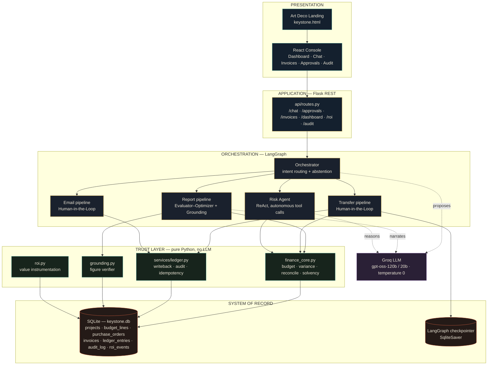

> On GitHub, click the diagram to open it full-screen with zoom and pan controls.

---

## How a request flows

Every request is classified once by the orchestrator, then routed to a pipeline. Reports run through an evaluator and a grounding gate before they are shown. Actions with financial consequence stop for a human and only write to the ledger after approval and a solvency check.

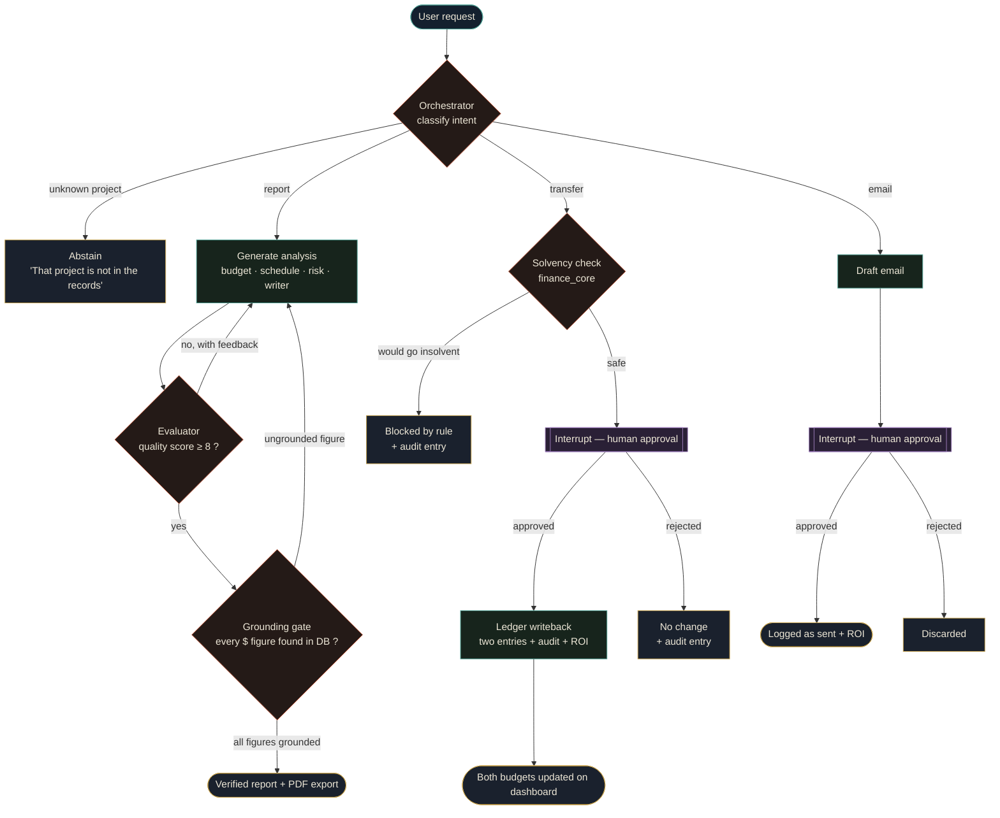

---

## Anti-hallucination engineering

This is the core of the project. Keystone layers five independent defences so that a fabricated figure has to pass through all of them to reach the user, which in practice it cannot.

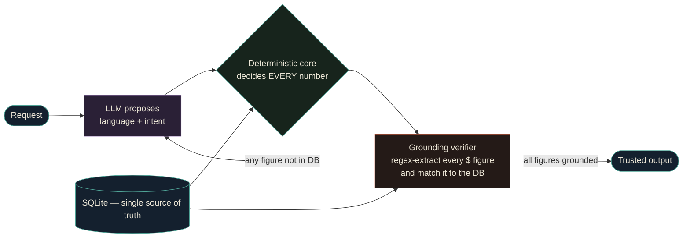

**1. Knowledge grounding on structured data.** Agents never free-associate over raw text. Budget, schedule, risk and reconciliation inputs are pulled from the database as structured values, so the model narrates data it was handed rather than data it recalls. This follows the grounding principle behind retrieval-augmented generation (Lewis et al., 2020).

**2. Deterministic decoding.** Every generation call runs at `temperature = 0`. For factual reporting, sampling diversity is a liability, not a feature.

**3. Strict abstention prompts.** Each agent is instructed to use only the figures, names and dates it was given, and to write *"not in records"* rather than guess. The orchestrator extends this to whole requests: asked for a project that does not exist, Keystone replies *"That project is not in the records. Available projects: ..."* instead of inventing one.

**4. Chain-of-Verification gate.** After a report is generated, `evaluators/grounding.py` extracts every dollar figure in the text with a regex, scales suffixes (`$2.30M`, `$180k`), and checks each one against the set of figures the database actually supports within a tolerance. Any ungrounded figure fails the report, and the workflow regenerates it with the failure as feedback. This is a practical implementation of Chain-of-Verification (Dhuliawala et al., 2023).

**5. Model proposes, code decides.** The hard architectural rule. No financial figure shown to the user is ever authored by the model. Budget totals, variances, reconciliation and solvency are all computed in `tools/finance_core.py`, which contains no LLM calls at all. The model's job is language and intent; the number's job belongs to Python.

Result: in verification runs, generated reports had **every** dollar figure traced back to the database (for example 21 of 21, 29 of 29, 34 of 34 figures grounded), and the test suite explicitly proves the verifier rejects an invented `$9,999,999` while correctly accepting legitimately scaled values like `$2.30M` and `$180k`.

---

## The deterministic finance core

`tools/finance_core.py` is the single source of every number, in plain, testable Python. Budget state is **derived from the ledger**, never read from a static field, so an approved transfer or posted invoice changes the dashboard immediately and consistently:

```
budget_total = sum(budgeted)  + transfers_in  - transfers_out
spent        = sum(actual)    + posted invoices
remaining    = budget_total - spent
```

Thresholds are explicit constants, so the rules are inspectable rather than hidden in prose:

- **Invoice reconciliation** matches each invoice to its purchase order and flags any overbill beyond a `2%` tolerance. Example from the seed data: invoice `INV-1001` from SteelWorks bills `$120,000` against a `$100,000` PO, and Keystone flags the `$20,000` (20%) overbill as *"Hold for review"* on its own.
- **Solvency check** blocks any transfer that would push the source project below zero remaining, with the reason recorded.
- **Idempotency** keys every executed action to its approval thread, so a repeated approval can never double-post.

---

## Human-in-the-loop

Anything with financial or external consequence, a budget transfer or an outbound email, is never executed autonomously. Keystone uses LangGraph's `interrupt()` / `Command(resume=...)` mechanism with a persistent `SqliteSaver` checkpointer: the graph pauses mid-execution, surfaces the proposed action with an AI impact analysis in the Approvals tab, and resumes exactly where it stopped only after a human approves or rejects. The decision, the reason, and the resulting state are all written to the audit log.

---

## ROI instrumentation

Every automated action logs a value event to `roi_events`, so the business case is measured rather than asserted. Baselines are configurable manual-effort estimates (for example a manual invoice reconciliation is modelled at 22 minutes, a status report at 90, an email at 15, a transfer at 35), and the console surfaces hours reclaimed, dollars flagged, and documents processed as live totals that increment with each action.

---

## Feature walkthrough

The landing page and the console both ship with a full day/night mode, toggled from the header, that recolors the entire interface. The remaining screenshots are shown in the dark (noir) theme.

| Night | Day |
|---|---|
| 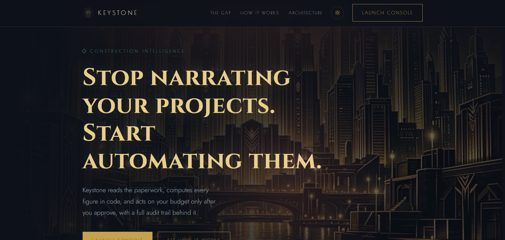 | 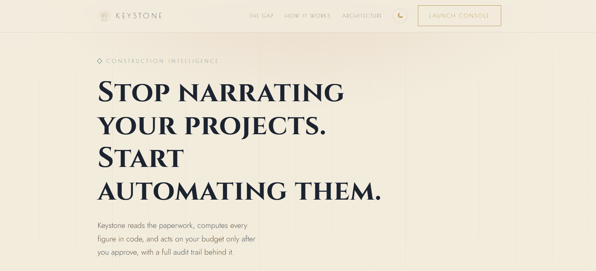 |

### The portfolio at a glance

The dashboard reads budget state live from the ledger. Alpha Tower is flagged **CRITICAL** because it is `$300,000` over its `$2,000,000` budget, computed from the data rather than stored as a status.

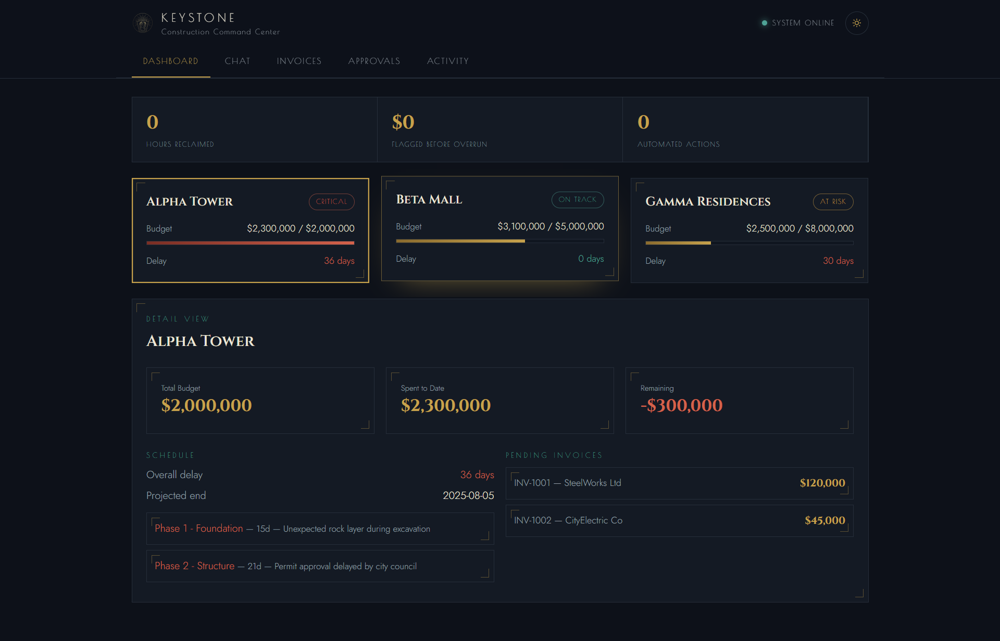

### A grounded status report

Asked for a status report, Keystone assembles budget, schedule, risk and a written executive summary, then passes it through the grounding gate. The footer records the verification: **"Grounding: all 21 figures trace to the record."** Every report can be exported to PDF with one click.

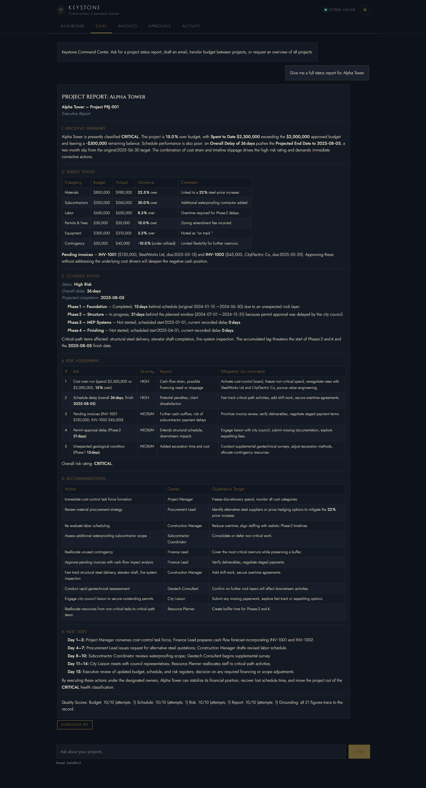

### Abstention instead of hallucination

Asked about a project that does not exist, Keystone refuses to invent one.

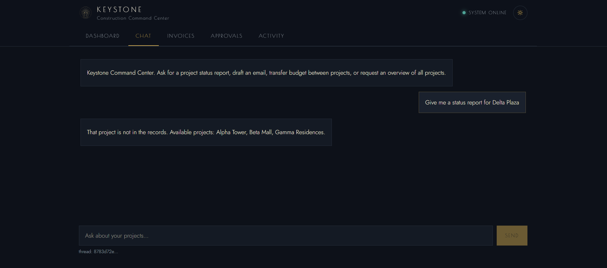

### Human-in-the-loop — a budget transfer

A transfer pauses for approval with a deterministic solvency check and an AI impact analysis. Here the `$950,000` move from Beta Mall eliminates Alpha Tower's `$300,000` deficit and leaves a `$650,000` surplus, all figures computed in code.

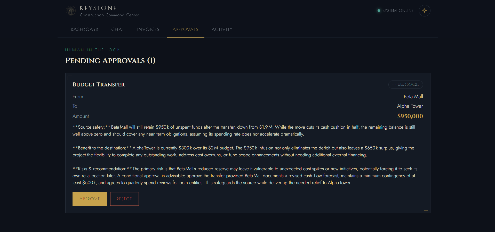

### Human-in-the-loop — an outbound email

Drafting an external email also stops for review, tagged by sensitivity.

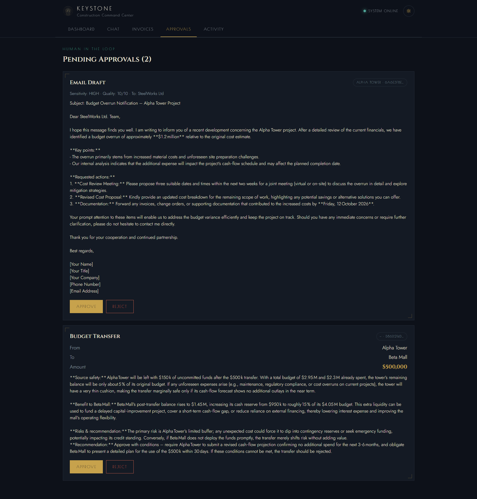

### Invoice automation — catching an overbill on its own

Keystone reads the invoice, reconciles it against its purchase order and the project's remaining budget, and flags the discrepancy without being told to.

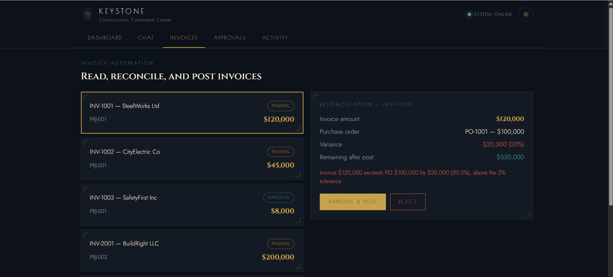

### A clean invoice, approved and posted

A clean invoice reconciles with zero variance and posts to the ledger; the project's remaining budget drops by exactly the invoice amount.

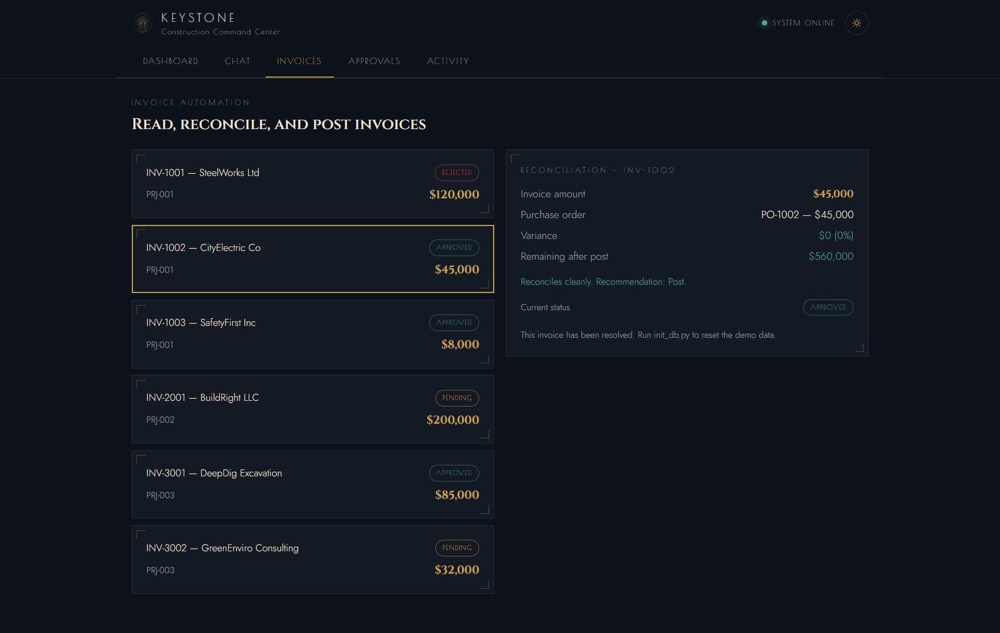

### The audit trail and measured value

Every executed action is written to the ledger and the audit log, and the ROI bar tracks hours reclaimed and actions automated as they happen.

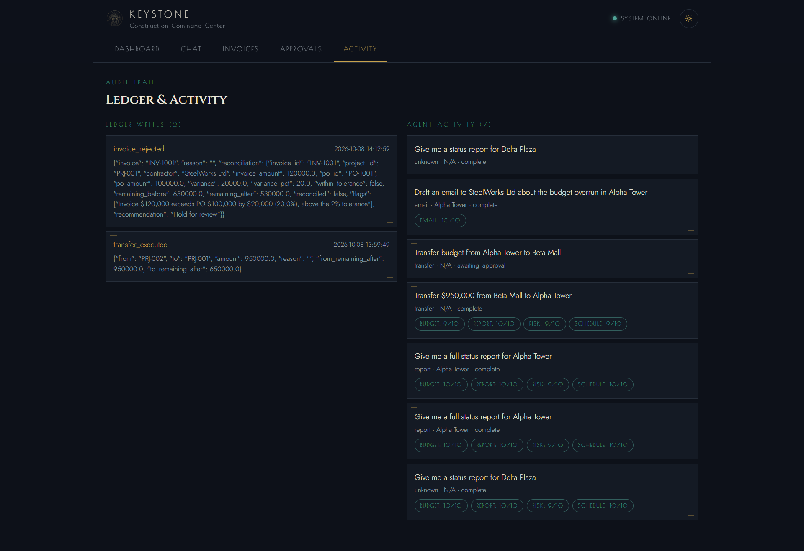

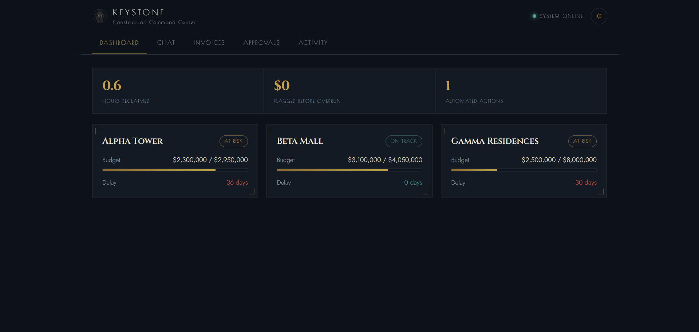

---

## Exported reports

Every generated report can be exported to a clean, typeset PDF directly from the chat, built client-side with jsPDF so there is no print dialog and no server round-trip. Three sample exports are included so they can be opened without running the app:

- [Alpha Tower report](docs/reports/alpha-tower-report.pdf) — a Critical project, 15% over budget
- [Beta Mall report](docs/reports/beta-mall-report.pdf) — a healthy project, on track
- [Gamma Residences report](docs/reports/gamma-residences-report.pdf) — an At Risk project

Every dollar figure in these PDFs is grounded against the database by the verifier in `evaluators/grounding.py`.

---

## Technology stack

| Layer | Technology |
|---|---|
| Orchestration | LangGraph (StateGraph, `interrupt`/`resume`, `SqliteSaver`) |
| Agent framework | LangChain, `create_react_agent` |
| Language model | Groq-hosted `gpt-oss-120b` / `gpt-oss-20b`, temperature 0 |
| Backend | Python 3.11, Flask, Flask-CORS |
| System of record | SQLite (WAL mode) |
| Frontend | React 18, custom Art Deco design system (CSS variables, day/night) |
| Report export | jsPDF + autoTable, marked, DOMPurify |
| Testing | pytest (11 tests over the finance core, grounding and ledger) |

---

## Project structure

```
construction-ai-command-center/
├── api/                 # Flask REST layer (routes.py, app.py)
├── workflows/           # LangGraph orchestration (main_graph.py)
├── agents/              # Budget, schedule, risk (ReAct), report agents
├── evaluators/          # grounding.py — the figure verifier
├── services/            # ledger.py — writeback, audit, idempotency
├── tools/               # finance_core.py, roi.py, db.py, data_loader.py
├── data/                # synthetic seed JSON (projects, budgets, invoices)
├── tests/               # test_finance.py — 11 passing tests
├── frontend/            # React console (Keystone design system)
├── img/                 # logo and visual assets
├── docs/                # screenshots and sample exported reports
├── init_db.py           # builds / resets keystone.db from the seed JSON
├── run.py               # starts the Flask API on :5000
└── requirements.txt
```

---

## Getting started

**Prerequisites:** Python 3.11+, Node.js 18+, and a Groq API key.

```bash
# 1. Backend dependencies
pip install -r requirements.txt

# 2. Configure the model key
echo "GROQ_API_KEY=your_key_here" > .env

# 3. Build the system of record from the seed data
python init_db.py

# 4. Start the API  (http://localhost:5000)
python run.py

# 5. In a second terminal, start the console (http://localhost:3000)
cd frontend
npm install
npm start
```

The landing page is served at `http://localhost:3000/keystone.html`, and the console entry is **Launch Console**. To reset all demo data to its clean baseline at any time, re-run `python init_db.py`.

---

## Testing

```bash
pytest tests/ -v
```

The suite proves the parts that must never drift: the budget baseline (Alpha Tower at `-$300,000`, 15% over), the `$20,000` overbill flag, a clean reconciliation, a transfer writeback with before/after balances, idempotency of a repeated approval, an insolvent transfer being blocked, invoice approval increasing spend, the grounding verifier rejecting an invented figure while accepting scaled ones, and ROI accumulation.

---

## Research and references

The engineering choices above are grounded in published work. Figures quoted in the app are synthetic (see the honesty note below); the sources here are for the *methods* and the *industry problem*, not for the demo numbers.

**Anti-hallucination and agent design**

1. Dhuliawala, S. et al. (2023). *Chain-of-Verification Reduces Hallucination in Large Language Models.* arXiv:2309.11495. — the verify-then-regenerate gate.
2. Ji, Z. et al. (2023). *Survey of Hallucination in Natural Language Generation.* ACM Computing Surveys. arXiv:2202.03629. — why grounding and abstention matter.
3. Lewis, P. et al. (2020). *Retrieval-Augmented Generation for Knowledge-Intensive NLP Tasks.* NeurIPS. arXiv:2005.11401. — grounding generation on retrieved structured data.
4. Yao, S. et al. (2023). *ReAct: Synergizing Reasoning and Acting in Language Models.* ICLR. arXiv:2210.03629. — the risk agent's reason-and-act tool loop.
5. Wei, J. et al. (2022). *Chain-of-Thought Prompting Elicits Reasoning in Large Language Models.* NeurIPS. arXiv:2201.11903.
6. Anthropic (2024). *Building Effective Agents.* — orchestrator-workers and evaluator-optimizer patterns.
7. LangGraph documentation. *Human-in-the-loop with interrupt and checkpointers.*

**Construction industry context**

8. McKinsey Global Institute (2017). *Reinventing Construction: A Route to Higher Productivity.*
9. McKinsey & Company (2020). *The Next Normal in Construction: How disruption is reshaping the world's largest ecosystem.*

---

## A note on honesty

All project, budget, schedule and invoice figures in this repository are **synthetic seed data** (`data/*.json`), created to exercise the logic. They are not real company figures. The point of the project is not the data; it is the architecture that guarantees whatever data *is* loaded will be reported exactly, verifiably, and never invented, and that any action taken on it is checked, approved, recorded, and reversible. The ROI baselines are explicit, configurable assumptions rather than measured client figures.

---

## License

Released under the MIT License. See [`LICENSE`](LICENSE).

<div align="center">
<br/>
<sub>Keystone · Construction AI Command Center · v1.0.0</sub>
</div>
