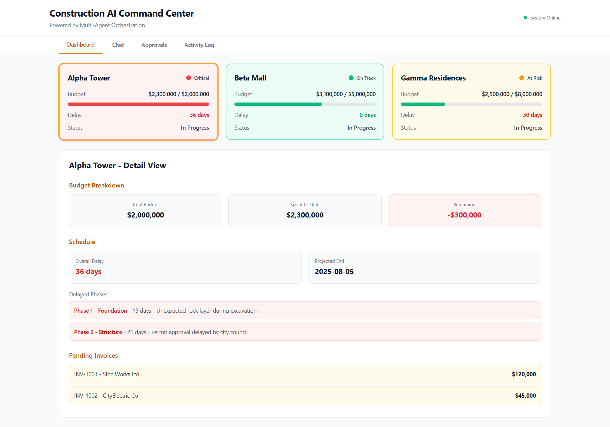
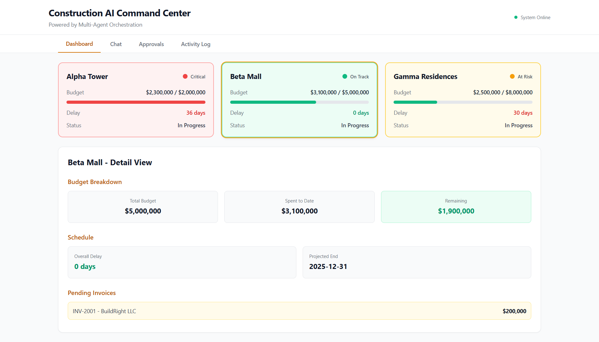
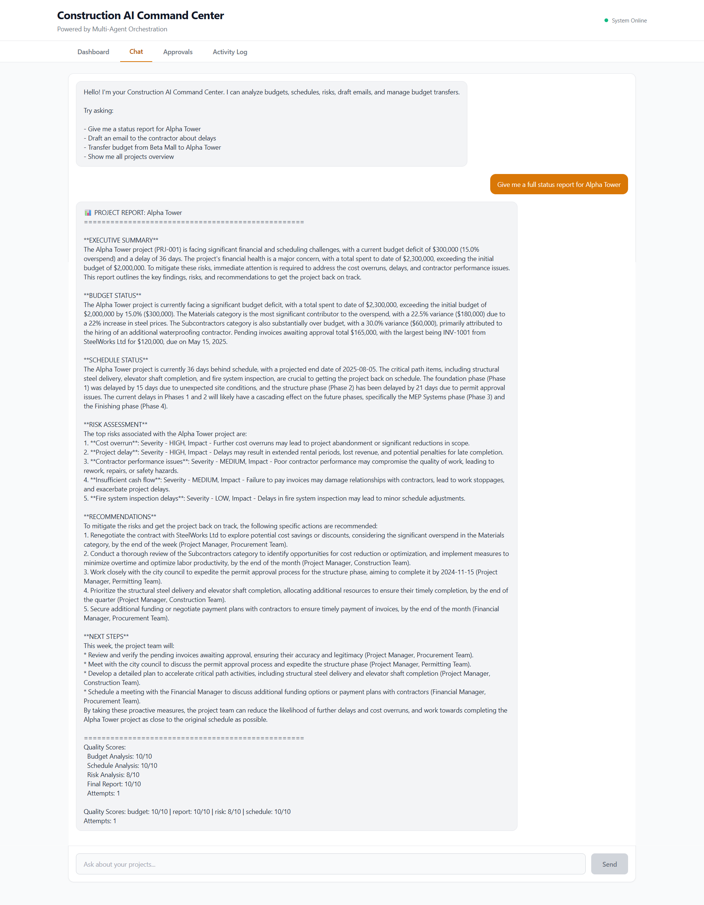
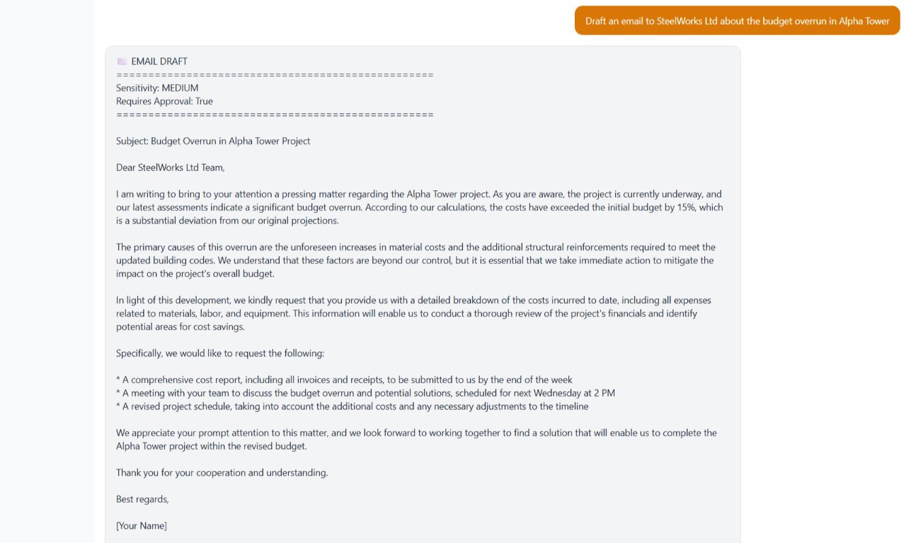
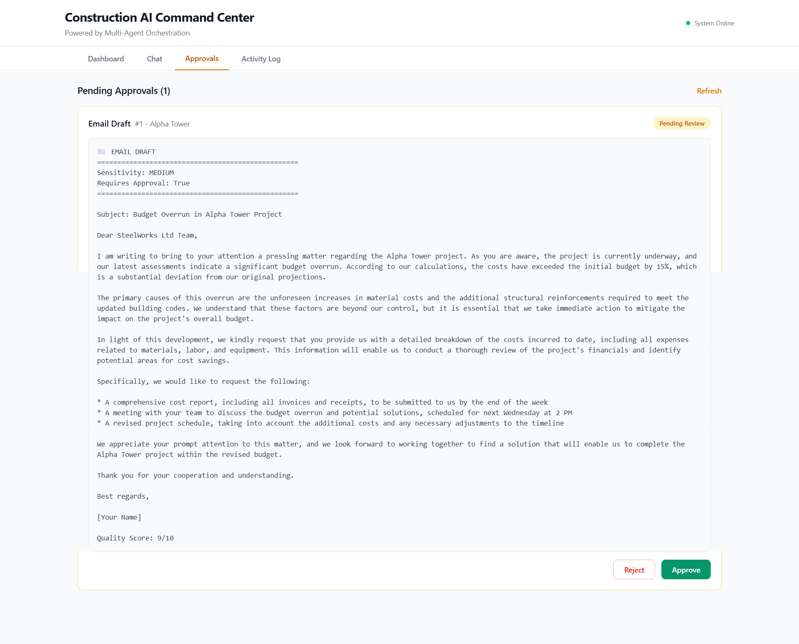
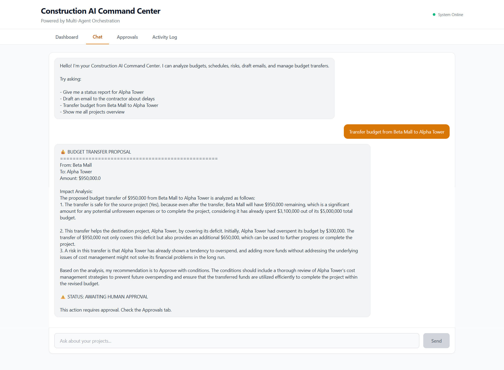
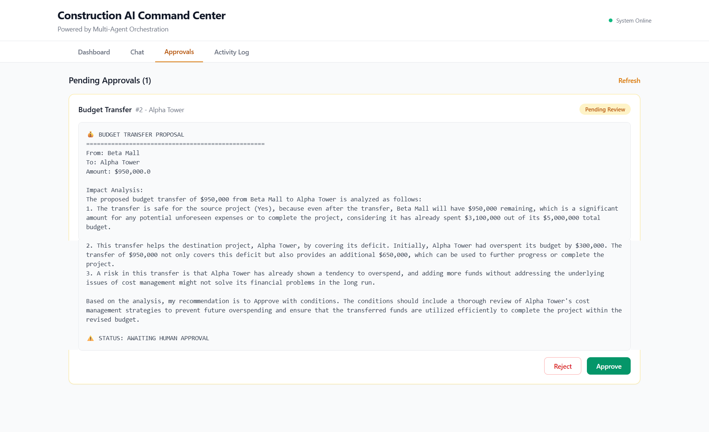
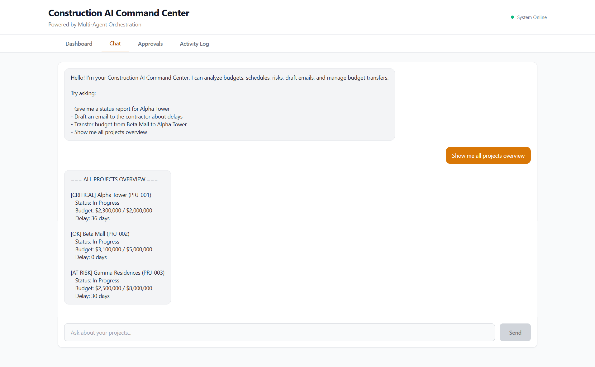
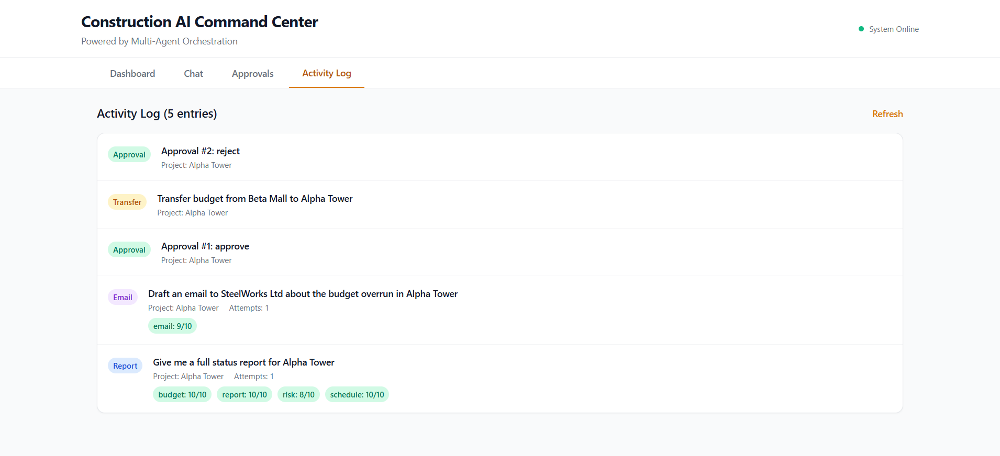

# Construction AI Command Center

A multi-agent AI system for construction project management. Built with LangGraph, Flask, and React. The system uses 6 specialized AI agents orchestrated through advanced design patterns to analyze budgets, track schedules, assess risks, draft communications, and manage financial transfers - all with built-in quality control and human oversight.



---

## Table of Contents

- [Overview](#overview)
- [Architecture and Design Patterns](#architecture-and-design-patterns)
- [Agents](#agents)
- [Features](#features)
- [Screenshots](#screenshots)
- [Tech Stack](#tech-stack)
- [Project Structure](#project-structure)
- [Setup and Installation](#setup-and-installation)
- [API Endpoints](#api-endpoints)
- [Key Design Decisions](#key-design-decisions)

---

## Overview

Construction projects involve complex coordination between budgets, schedules, contractors, and risk management. This system replaces manual analysis with an AI-powered command center where a project manager can ask questions in natural language and receive comprehensive, quality-checked responses.

The system is not a simple chatbot. It is a multi-agent orchestration system where each request is routed to specialized agents, evaluated for quality, and flagged for human approval when necessary.

---

## Architecture and Design Patterns

This project implements three core Agentic AI design patterns. Each pattern solves a specific problem in building reliable AI systems.

### Pattern 1: Orchestrator

The Orchestrator pattern uses a central manager agent that receives user requests, determines what type of task it is, and routes it to the appropriate specialized agents.

When a user sends a request, the Orchestrator agent analyzes the message and classifies it into one of four task types:

- **report** - Routes to Budget Agent, Schedule Agent, Risk Agent, then Report Agent
- **email** - Routes to Email Agent
- **transfer** - Routes to Budget Transfer Agent
- **status** - Routes directly to data retrieval with no LLM needed

The Orchestrator never does the actual analysis. It only decides who should do it and in what order. This separation ensures each agent can focus on its specialty.

```
User Request
     |
     v
Orchestrator (classifies the request)
     |
     |--> "report"   --> Budget Agent --> Schedule Agent --> Risk Agent --> Report Agent
     |--> "email"    --> Email Agent
     |--> "transfer" --> Budget Transfer Agent
     |--> "status"   --> Data Retrieval (no LLM)
```

Without an orchestrator, you would need one massive agent that handles everything. That agent would be slow, unreliable, and impossible to maintain. The orchestrator pattern lets you build, test, and improve each agent independently.

Code location: `workflows/main_graph.py` - `orchestrator_node()` function

### Pattern 2: Evaluator-Optimizer

The Evaluator-Optimizer pattern adds a quality control loop. After an agent produces output, a separate evaluator agent scores it against specific criteria. If the score is below the threshold, the output is sent back for regeneration with feedback.

Every agent output is evaluated before being accepted:

- **Budget Analysis** is scored on data usage, root cause identification, specificity, completeness, professionalism (0-10)
- **Schedule Analysis** is scored on the same five criteria (0-10)
- **Risk Analysis** is scored on the same five criteria (0-10)
- **Final Report** is scored on executive summary quality, data accuracy, structure, actionable recommendations, brevity (0-10)
- **Email Drafts** are scored on subject line, tone, clarity, action items, purpose alignment (0-10)

If a score is below the passing threshold (7/10 for analyses, 8/10 for reports and emails), the output is regenerated with the evaluator's specific feedback. This loop runs up to 3 times maximum to prevent infinite loops.

```
Agent generates output
        |
        v
Evaluator scores output (0-10)
        |
        v
Score >= threshold? --- YES --> Accept output
        |
        NO
        |
        v
Send feedback to Agent
        |
        v
Agent regenerates (attempt 2 of 3)
        |
        v
Evaluator scores again...
```

LLMs are not deterministic. The same prompt can produce vastly different quality outputs. The evaluator loop ensures every output meets a minimum quality standard before reaching the user.

Code locations:
- `evaluators/analysis_evaluator.py` - Scores budget, schedule, and risk analyses
- `evaluators/report_evaluator.py` - Scores executive reports
- `evaluators/email_evaluator.py` - Scores email drafts
- `workflows/main_graph.py` - `should_retry_report()` and `should_retry_email()` functions control the loop

### Pattern 3: Human-in-the-Loop

The Human-in-the-Loop pattern pauses the agent workflow at critical decision points and requires human approval before proceeding. Not every action needs oversight - only high-risk or irreversible ones.

Two types of actions always require human approval:

1. **Email sending** - Emails classified as MEDIUM or HIGH sensitivity are routed to the Approval Queue. The agent drafts the email and classifies its sensitivity level automatically, but a human must approve before it is sent.

2. **Budget transfers** - All financial transfers require human authorization regardless of amount. The agent proposes the transfer, calculates the impact on both projects, and presents a recommendation, but the final decision is human.

Actions that do NOT require approval:
- Status reports (read-only, no side effects)
- Budget analysis (read-only)
- Schedule analysis (read-only)
- Risk assessment (read-only)
- Low-sensitivity emails (routine confirmations)

```
Agent completes work
        |
        v
Is this a sensitive action?
        |
        |--> NO  --> Return result directly
        |
        |--> YES --> Add to Approval Queue
                         |
                         v
                  Human reviews
                         |
                  Approve / Reject
```

Full automation is not always desirable. Some decisions carry real consequences. HITL gives the AI system the ability to do the work while keeping humans in control of the decisions that matter.

Code locations:
- `agents/email_agent.py` - `draft_email()` classifies sensitivity and sets `requires_approval`
- `agents/budget_transfer_agent.py` - Always sets `requires_approval: True`
- `api/routes.py` - Approval queue management and approve/reject endpoints

### How the patterns work together

The three patterns form a layered architecture:

```
Layer 1: ORCHESTRATOR
   Receives request, routes to agents
        |
Layer 2: EVALUATOR-OPTIMIZER
   Each agent's output is quality-checked
        |
Layer 3: HUMAN-IN-THE-LOOP
   Sensitive actions pause for approval

Full flow example: "Draft an email about budget overrun"

1. Orchestrator identifies task type: "email"
2. Email Agent drafts the email
3. Email Evaluator scores it (9/10 - passes)
4. Email Agent classifies sensitivity: MEDIUM
5. System adds email to Approval Queue
6. Human reviews and approves/rejects
```

---

## Agents

| Agent | Responsibility | Uses Evaluator | Requires Approval |
|-------|---------------|----------------|-------------------|
| Budget Agent | Analyzes project budget data, identifies overruns and problem categories | Yes (7/10 threshold) | No |
| Schedule Agent | Analyzes project timeline, identifies delays and root causes | Yes (7/10 threshold) | No |
| Risk Agent | Combines budget and schedule data to identify and classify project risks | Yes (7/10 threshold) | No |
| Report Agent | Generates executive reports from all analyses | Yes (8/10 threshold) | No |
| Email Agent | Drafts professional emails with automatic sensitivity classification | Yes (8/10 threshold) | Yes (MEDIUM/HIGH sensitivity) |
| Budget Transfer Agent | Proposes financial transfers between projects with impact analysis | No | Yes (always) |

---

## Features

**Dashboard**
- Real-time overview of all projects with color-coded status indicators (Critical / At Risk / On Track)
- Click any project to see detailed budget breakdown, schedule status, delayed phases, and pending invoices

**AI Chat Interface**
- Natural language queries about project status, budgets, schedules, and risks
- Multi-agent orchestration handles complex requests automatically
- Quality scores displayed for every AI-generated output

**Approval Queue**
- Email drafts and budget transfers require human approval before execution
- Each approval item shows full context and agent reasoning
- Approve or reject with one click

**Activity Log**
- Complete audit trail of all agent actions
- Quality scores, attempt counts, and task types recorded
- Full traceability for compliance and review

---

## Screenshots

### Dashboard - Project Overview
Color-coded project cards showing budget utilization, delays, and status at a glance.




### AI Chat - Status Report
The Orchestrator routes this request through 4 agents (Budget, Schedule, Risk, Report), each evaluated for quality.



### AI Chat - Email Drafting
The Email Agent drafts a professional email and classifies its sensitivity. Medium and High sensitivity emails are routed to the Approval Queue.



### Approval Queue - Human Review
Sensitive actions pause here for human decision. The agent provides full context and reasoning.



### AI Chat - Budget Transfer
The Budget Transfer Agent calculates impact on both projects and always requires human approval.



### Approval Queue - Budget Transfer
Financial decisions always require human authorization regardless of amount.



### AI Chat - All Projects Overview
A quick summary of all projects with status flags. This request uses data retrieval only with no LLM calls needed.



### Activity Log
Complete audit trail showing all agent actions, quality scores, and approval decisions.



---

## Tech Stack

**Backend**
- Python 3.11
- Flask (REST API)
- LangGraph (Agent orchestration and workflow management)
- LangChain (LLM integration)
- Groq API with Llama 3.3 70B (Language model)

**Frontend**
- React 18
- Tailwind CSS (Styling)
- Axios (API communication)

**Data**
- JSON-based project data (simulated realistic construction data)
- In-memory approval queue and activity log

---

## Project Structure

```
construction-ai-command-center/
|
|-- data/
|   |-- projects.json
|   |-- budgets.json
|   |-- schedules.json
|   |-- contractors.json
|
|-- agents/
|   |-- budget_agent.py
|   |-- schedule_agent.py
|   |-- risk_agent.py
|   |-- report_agent.py
|   |-- email_agent.py
|   |-- budget_transfer_agent.py
|
|-- evaluators/
|   |-- analysis_evaluator.py
|   |-- report_evaluator.py
|   |-- email_evaluator.py
|
|-- tools/
|   |-- data_loader.py
|   |-- calculator.py
|
|-- workflows/
|   |-- main_graph.py
|
|-- api/
|   |-- app.py
|   |-- routes.py
|
|-- frontend/
|   |-- src/
|       |-- App.js
|       |-- components/
|           |-- Dashboard.jsx
|           |-- ChatInterface.jsx
|           |-- ApprovalQueue.jsx
|           |-- ActivityLog.jsx
|
|-- run.py
|-- test_quick.py
|-- requirements.txt
```

---

## Setup and Installation

### Prerequisites
- Python 3.11+
- Node.js 18+
- Groq API key (free at console.groq.com)

### Backend Setup

```bash
git clone https://github.com/YOUR_USERNAME/construction-ai-command-center.git
cd construction-ai-command-center
pip install -r requirements.txt
```

Create a `.env` file in the root directory:

```
GROQ_API_KEY=your_groq_api_key_here
```

Start the backend:

```bash
python run.py
```

### Frontend Setup

```bash
cd frontend
npm install
npm start
```

The application will be available at `http://localhost:3000`

---

## API Endpoints

| Method | Endpoint | Description |
|--------|----------|-------------|
| POST | /api/chat | Send a natural language request to the agent system |
| GET | /api/dashboard | Get overview of all projects |
| GET | /api/project/id | Get detailed data for a specific project |
| GET | /api/approvals | Get all pending approval items |
| POST | /api/approvals/id | Approve or reject an item |
| GET | /api/activity | Get the complete activity log |
| GET | /api/invoices/id | Get pending invoices for a project |

---

## Key Design Decisions

1. **Sequential agent execution for reports** - Budget, Schedule, and Risk agents run sequentially rather than in parallel. This is intentional because the Risk Agent needs budget and schedule data to make accurate risk assessments.

2. **Sensitivity-based email routing** - Not all emails need approval. Low-sensitivity emails like meeting confirmations and routine updates pass through automatically. Only MEDIUM and HIGH sensitivity emails require human review.

3. **Maximum retry limit** - The evaluator-optimizer loop is capped at 3 attempts. Without this limit, a strict evaluator could create an infinite loop. Three attempts provides quality improvement while keeping response times reasonable.

4. **Separate evaluator agents** - Evaluators are separate from generators. This prevents the grading your own homework problem where an agent might rate its own output too generously.

5. **All budget transfers require approval** - Financial actions are irreversible. Regardless of amount or analysis confidence, human authorization is mandatory.